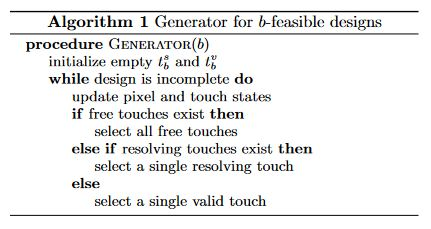
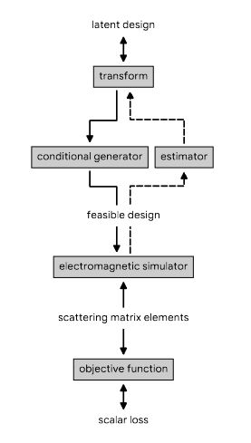

# Gruyere

An attempt to reproduce results from the paper [_Inverse design of photonic devices with strict foundry fabrication constraints_](https://arxiv.org/abs/2201.12965).

One of the goal of the package will be the implementation of the paper results
in windowed operations to reduce the calculations complexity.
Moreover, the ultimate goal will be to rely as mush as possible on pure python!

## Main ideas

### 1. Implement the Algorithm 1
<!---

!--->

### 2. Use the Algorithm 1 to optimize some nanophotonic devices
<!---

!--->

### 3. Enjoy !

## Credits

Some snippets came from [inverse_design](https://github.com/flaport/inverse_design) by [@flaport](https://github.com/flaport/).
