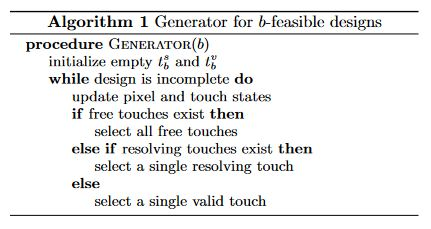

# Gruyere

An attempt to reproduce results from the paper [_Inverse design of photonic devices with strict foundry fabrication constraints_](https://arxiv.org/abs/2201.12965).

### Main ideas

Basic ideas:
1. aze
2. aze

<!---

!--->

<!---

!--->
